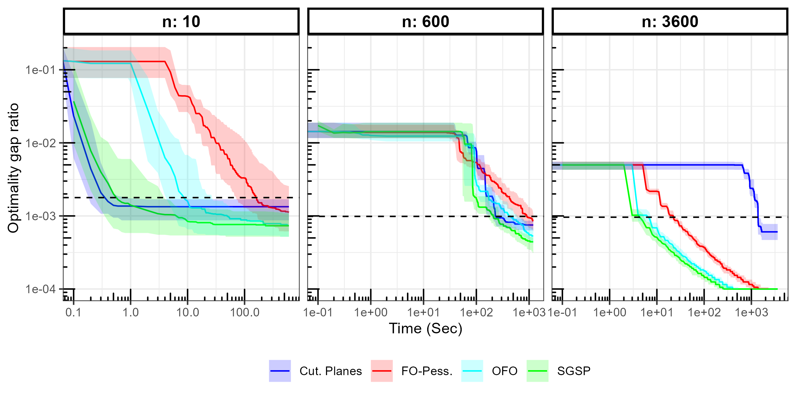
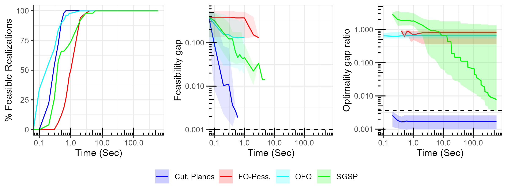

[](https://pubsonline.informs.org/journal/ijoc)

# Introduction

This archive is distributed in association with the [INFORMS Journal on
Computing](https://pubsonline.informs.org/journal/ijoc) under the [MIT License](LICENSE).

The software and data in this repository are a snapshot of the software and data that were used in the research reported on in the paper 
'First-order algorithms for robust optimization problems via convex-concave saddle-point Lagrangian reformulation' (https://doi.org/10.1287/ijoc.2022.0200) by K. Postek and S. Shtern. 

## Cite

To cite the contents of this repository, please cite both the paper and this repo, using their respective DOIs.

https://doi.org/10.1287/ijoc.2022.0200

https://doi.org/10.1287/ijoc.2022.0200.cd

Below is the BibTex for citing this snapshot of the respoitory.

```
@article{CacheTest,
  author =        {K. Postek and S. Shtern},
  publisher =     {INFORMS Journal on Computing},
  title =         {First-order algorithms for robust optimization problems via convex-concave saddle-point Lagrangian reformulation},
  year =          {2022},
  doi =           {10.1287/ijoc.2022.0200.cd},
  url =           {https://github.com/INFORMSJoC/2022.0200},
}  
```

## Description

The goal of this software is to generate QCQP problems with ball uncertainty and compare the performance of the approach suggested in the paper using the Lagrangian formulation with the existing approach based on online convex optimization.

## Important dependencies

Aside from standard Python numerical (numpy and scipy) and data analysis (pandas) libraries, this repository uses two optimization modelling packages:
- gurobipy: needs to be used in combination with the Gurobi solver, used to solve the large-scale convex quadratic optimization problems
- casadi: used in combination with the IPOPT solver, used to solve the small scale quadratic optimization problems with close-to-singular quadratic forms.

## Running

In Linux, the experiment can be run using the script Run_QCQP_script.sh from the script folder

```
chmod +x Run_QCQP_script.sh
./Run_QCQP_script.sh
```

Note that script will run a total of 50 realizations in batches of 10.

The parameters used in the script (input in this order) are
- m+1=4: (meaning m=3 uncertain constraint and an objective, for running unconstrained problems choose 1)
- n=10 (dimension of variable x)
- l=10 (number of rows in linear transformation of x)
- k=10 (the dimension of the z_i in each constraint i)
- seed - calculated automatically
- Time limit=600  

The scripts runs the Python script QCQP.py located in the src folder. This script prepares the data and elementary functions and calls both SGSP and OCO with several parameter combination for solving the robuts problem.


## Results

Figure 1 in the paper shows the results of the optimality gap for the various sized problem with no constraints.



Figures 2 to 4 in the paper show the percent of feasible instances, the feasibility gap, and the optimality gap vs. time. Figure 2 does this for the small instances, 



Figure 3 for the medium instances,


and Figure 4 for the large instances.


## Replicating

To replicate the results in the paper the Run_QCQP_script.sh script should be changed as follows:

The small examples in the paper are ran with 
```
cpulimit -l 100 -i python3 ../src/QCQP.py 1 10 10 10 $seed 600&>output$seed.txt&
cpulimit -l 100 -i python3 ../src/QCQP.py 4 10 10 10 $seed 600&>output$seed.txt&

```
The medium examples are ran with
```
cpulimit -l 100 -i python3 ../src/QCQP.py 1 600 15 25 $seed 1200&>output$seed.txt&
cpulimit -l 100 -i python3 ../src/QCQP.py 4 600 15 25 $seed 1200&>output$seed.txt&
```

The medium examples are ran with
```
cpulimit -l 100 -i python3 ../src/QCQP.py 1 3600 16 30 $seed 3600&>output$seed.txt&
cpulimit -l 100 -i python3 ../src/QCQP.py 4 3600 16 30 $seed 3600&>output$seed.txt&
```
The files resulting from running these scripts are currently in the results folder.

Figures [Figure 1](results/opt_gap_noconstraints.eps.png), [Figure 2](results/all_graphs_n10_m4_k10_l10.eps.png), 
[Figure 3](results/all_graphs_n600_m4_k25_l15.eps.png), and [Figure 4](results/all_graphs_n600_m4_k25_l15.eps.png) are created by 
running the following R script (using Rstudio or Rscript) from the script folder
```
DataAnalysis.R
```
The script will automatically generate all plots.
